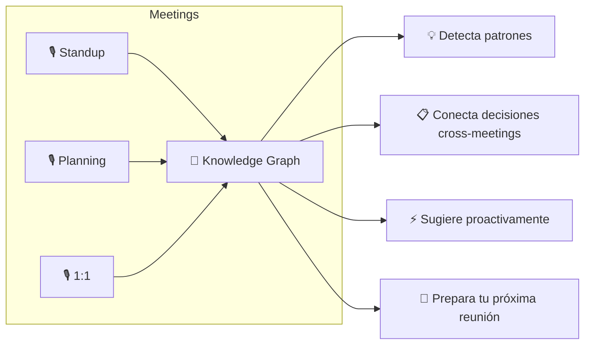
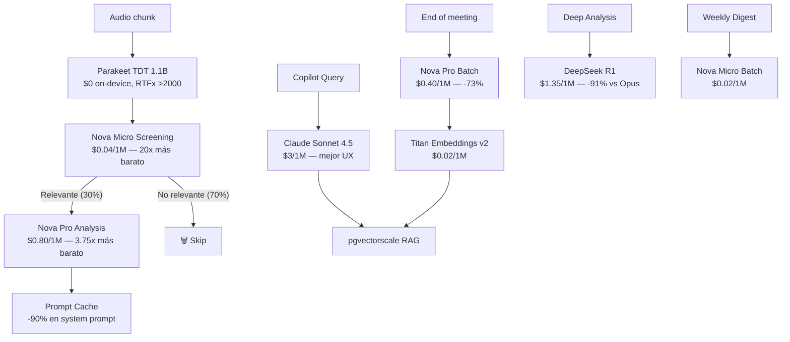

# 🧠 Aura Meet — Vision 2026: The Learning AI Copilot

> **No somos una app que graba reuniones. Somos un segundo cerebro que aprende de cada conversación.**

---

## 🔮 La Visión

Cada reunión alimenta tu **Personal Knowledge Graph**. Aura no solo transcribe — **entiende**, **conecta** y **aprende**. Cuantas más reuniones tienes, más inteligente se vuelve.



---

## 💎 Learning Copilot Features

### 1. "Ask Aura" — Chat con tus reuniones
```
Tú: "¿Qué decidimos sobre el pricing?"
Aura: "En tu reunión del 12 Feb con Carlos y Ana:
       1. Plan Pro a $9.99
       2. Free tier: 3 reuniones/semana
       📌 Pendiente: Carlos - investigar RevenueCat"
```

### 2. Pre-Meeting Briefing
Antes de cada reunión, Aura te prepara automáticamente:
- Action items pendientes de reuniones anteriores con ese equipo
- Temas recurrentes que podrían surgir
- Contexto relevante de reuniones pasadas

### 3. Weekly Digest AI
Resumen semanal: horas en meetings, action items completados vs pendientes, tema dominante, sugerencias de productividad.

### 4. Adaptive Personality
El copilot aprende TU estilo: idioma preferido, nivel de detalle, formato, y tono. Se adapta con cada reunión.

### 5. Cross-Meeting Intelligence
Conecta ideas entre reuniones diferentes: "La propuesta de cache de Carlos es similar a lo que sugirió Ana hace 2 semanas."

### 6. Follow-up Automático
"Hace 5 días dijiste que ibas a revisar el PR de Juan. ¿Ya lo hiciste?"

---

## ⚡ Arquitectura 2026 — Maximum Power, Minimum Cost

> [!IMPORTANT]
> **Investigación completa Feb 2026.** Cada componente verificado con benchmarks y pricing actuales.

### 🧬 Stack Tecnológico State-of-the-Art (Verificado Feb 2026)

| Componente | Anterior | **NUEVO 2026** | Ahorro |
|---|---|---|---|
| **Screening AI** | Haiku 3.5 ($0.80/1M) | **Amazon Nova Micro** ($0.04/1M) | **🔥 -95% (20x más barato)** |
| **Analysis AI** | Sonnet 4.5 ($3.00/1M) | **Amazon Nova Pro** ($0.80/1M) | **-73%** |
| **Copilot AI** | Sonnet 4.5 ($3.00/1M) | **Claude Sonnet 4.5** ($3.00/1M) | Mantener (mejor calidad para UX) |
| **Deep Reasoning** | Opus 4 ($15/1M) | **DeepSeek R1** ($1.35/1M) | **-91%** |
| **Summary** | Sonnet Batch ($1.50/1M) | **Nova Pro Batch** ($0.40/1M) | **-73%** |
| **Embeddings** | Titan v2 ($0.02/1M) | **Titan Embeddings v2** ($0.02/1M) | Same (ya óptimo) |
| **STT** | Parakeet TDT v3 ($0) | **Parakeet TDT 1.1B** ($0, RTFx >2000) | $0 ✅ |
| **Compute** | c8g.xlarge Graviton4 | **c8g.xlarge Graviton4** ($79/mo) | Ya óptimo ✅ |
| **Container** | ECS Fargate Spot | **Fargate ARM64 Spot** (-76%) | Ya óptimo ✅ |
| **Vector DB** | pgvector | **pgvector + pgvectorscale** (28x vs Pinecone) | $0 adicional ✅ |
| **Cache** | Valkey Serverless | **Valkey Serverless** | Ya óptimo ✅ |

### 🔥 Descubrimiento Clave: Amazon Nova Model Family

Amazon Nova es el **game-changer** para costos. Todos disponibles en Bedrock:

| Modelo | Input/1M | Output/1M | Batch Input | Uso ideal |
|---|---|---|---|---|
| **Nova Micro** | $0.04 | $0.14 | $0.02 | Screening (20x < Haiku) |
| **Nova Lite** | $0.06 | $0.24 | $0.03 | Multimodal light |
| **Nova Pro** | $0.80 | $3.20 | $0.40 | Analysis (3.75x < Sonnet) |
| **Nova Premier** | $2.50 | $12.50 | $1.25 | Complex reasoning |

> vs **Haiku 3.5**: $0.80 input / $4.00 output
> vs **Sonnet 4.5**: $3.00 input / $15.00 output

### 🧠 Modelo de Routing Multi-LLM Optimizado



### 📊 Tabla Maestra de Modelos por Capa

| Capa | Modelo | Precio/1M input | Cuándo se usa |
|---|---|---|---|
| **Screening** | Nova Micro | $0.04 | Cada 5 seg de audio |
| **Analysis** | Nova Pro | $0.80 | Solo si screening = relevante (30%) |
| **Copilot** | Claude Sonnet 4.5 | $3.00 | Queries del usuario (pocas/meeting) |
| **Summary** | Nova Pro (Batch) | $0.40 | Al final de cada meeting |
| **Weekly Digest** | Nova Micro (Batch) | $0.02 | 1x/semana |
| **Deep Reasoning** | DeepSeek R1 | $1.35 | Solo Business tier |
| **Embeddings** | Titan v2 | $0.02 | Post-meeting indexing |
| **STT** | Parakeet TDT 1.1B | $0.00 | On-device, siempre |

---

## 📊 Costos Reales — Ultra-Optimizados

### Costo AI por Usuario/mes (Comparación)

| Componente | Plan Anterior | **Plan NUEVO 2026** | Ahorro |
|---|---|---|---|
| Screening (20 meetings) | $0.08 (Haiku) | **$0.004** (Nova Micro) | **-95%** |
| Analysis (30% relevante) | $0.14 (Sonnet) | **$0.037** (Nova Pro) | **-73%** |
| Summary (20 meetings) | $0.45 (Sonnet Batch) | **$0.12** (Nova Pro Batch) | **-73%** |
| Copilot (10 queries/mes) | $0.05 (Sonnet) | $0.05 (Sonnet) | — |
| Embeddings | $0.02 | $0.02 | — |
| Ask Aura RAG | $0.05 (Haiku) | **$0.003** (Nova Micro) | **-94%** |
| Weekly Digest | $0.06 (Batch) | **$0.003** (Nova Micro Batch) | **-95%** |
| **Total/user/mes** | **$0.80** | **$0.24** | **🔥 -70%** |

### Infraestructura por Fase

| Fase | Total/mes | Detalle |
|---|---|---|
| **1: Launch** (0-500) | **$85** | EC2 c8g.xlarge Graviton4, PostgreSQL embedded |
| **2: Growth** (500-5K) | **$150-300** | ECS Fargate ARM64, RDS t4g.micro + pgvectorscale |
| **3: Scale** (5K-50K) | **$300-900** | Fargate ARM64 Spot (-76%), RDS multi-AZ, SQS workers |

### Revenue vs Costs (25% Pro conversion)

| Total users | Paying | Infra + AI | Revenue | **Net Profit** | **Margin** |
|---|---|---|---|---|---|
| 200 | 50 | $97 | $500 | **+$403** | 80% |
| 500 | 125 | $180 | $1,249 | **+$1,069** | 86% |
| 1,000 | 250 | $310 | $2,498 | **+$2,188** | 88% |
| 5,000 | 1,250 | $750 | $12,488 | **+$11,738** | 94% |
| 10,000 | 2,500 | $1,300 | $24,975 | **+$23,675** | 95% |

> [!IMPORTANT]
> **Profitable desde el día 1 con 200 usuarios.** Márgenes de 80-95% gracias a Nova + Graviton4 + pgvectorscale.

---

## 💰 Pricing

| Plan | Precio | Incluye |
|---|---|---|
| **Free** | $0 | 3 reuniones/semana, transcripción, 1 insight/reunión |
| **Pro** | **$9.99/mes** | Ilimitado, Ask Aura, Weekly Digest, Briefings, export, history |
| **Team** | **$19.99/user/mes** | Pro + shared knowledge base, team analytics, integrations |
| **Business** | **$39.99/user/mes** | Team + SSO, API, DeepSeek R1 reasoning, custom models, SLA |

---

## 🏗️ Evolución de Arquitectura

### Fase 1: Launch (0-500 users) — **$85/mes**

```
iPhone ──WebSocket──▶ EC2 c8g.xlarge (Graviton4 ARM, $79/mo)
                       ├── FastAPI (uvicorn)
                       ├── Parakeet TDT 1.1B (STT on-device, RTFx >2000)
                       ├── PostgreSQL embedded + pgvector + pgvectorscale
                       └──▶ Amazon Bedrock
                             ├── Nova Micro (screening, $0.04/1M)
                             ├── Nova Pro (analysis, $0.80/1M)
                             ├── Sonnet 4.5 (copilot, $3.00/1M)
                             ├── Prompt Cache enabled (-90%)
                             └── Intelligent Routing (-30%)
```

### Fase 2: Growth (500-5K users) — **$150-300/mes**

```
iPhone ──▶ ALB ──▶ ECS Fargate ARM64 (Graviton4)
                    ├── STT Tasks (auto-scale 2-8)
                    ├── API Tasks (2-4)
                    └──▶ Bedrock (Nova + Sonnet + routing + cache + batch)
           
           RDS PostgreSQL t4g.micro (Graviton, $12/mo)
           ├── pgvector + pgvectorscale (28x > Pinecone)
           ├── Knowledge Graph (JSONB + relations)
           └── Meeting history + embeddings

           S3 Intelligent-Tiering (audio → Glacier after 30d)
           Lambda SnapStart (Python, async workers)
```

### Fase 3: Scale (5K-50K users) — **$300-900/mes**

```
iPhone ──▶ CloudFront ──▶ ALB ──▶ ECS Fargate ARM64 Spot (multi-AZ, -76%)
                                   ├── STT cluster (Spot, auto-scale)
                                   ├── API cluster (On-Demand, stable)
                                   ├── Embedding workers (Spot, async via SQS)
                                   └──▶ Bedrock cross-region
                                         ├── Nova Micro/Pro (screening + analysis)
                                         ├── Sonnet 4.5 (copilot)
                                         ├── DeepSeek R1 (Business deep reasoning)
                                         └── Nova Pro Batch (summaries, digests)

           RDS PostgreSQL t4g.medium (multi-AZ, pgvectorscale)
           ElastiCache Valkey Serverless (sessions, ~$10/mo)
           SQS (async: summaries, digests, embeddings)
           Lambda SnapStart + SQS (event-driven workers)
           S3 + Glacier (audio lifecycle)
           CloudWatch + X-Ray (observability)
```

---

## 🗺️ Roadmap por Sprints

### Sprint 1: Monetización (3 sem)
- [ ] RevenueCat — subscriptions iOS/Android
- [ ] Paywall UI con Free/Pro/Team
- [ ] Meeting History (PostgreSQL)
- [ ] Export (copy, share, email)
- [ ] Privacy Policy + Terms

### Sprint 2: Nova Migration + Memory Engine (3 sem)
- [ ] **Migrar screening a Nova Micro** ($0.04 vs $0.80 de Haiku)
- [ ] **Migrar analysis a Nova Pro** ($0.80 vs $3.00 de Sonnet)
- [ ] PostgreSQL + pgvector + pgvectorscale
- [ ] Embeddings pipeline (Titan v2)
- [ ] "Ask Aura" — RAG chat con Nova Micro

### Sprint 3: Intelligence (4 sem)
- [ ] Knowledge Graph (entities + relations en PostgreSQL JSONB)
- [ ] Pre-Meeting Briefing automático
- [ ] Weekly Digest AI (Nova Micro Batch, $0.02/1M)
- [ ] Action item tracking + follow-up
- [ ] Adaptive personality

### Sprint 4: Cost Optimization (2 sem)
- [ ] Migrar EC2 → c8g.xlarge (Graviton4) si no está
- [ ] Bedrock Prompt Caching en todos los agentes
- [ ] Bedrock Intelligent Prompt Routing
- [ ] Nova Pro Batch API para summaries/digests
- [ ] S3 Intelligent-Tiering + lifecycle policies

### Sprint 5: Growth (3 sem)
- [ ] Android app (Flutter = mismo code)
- [ ] Apple Watch companion
- [ ] ECS Fargate ARM64 Spot migration (-76%)
- [ ] Lambda SnapStart workers (Python, async)

### Sprint 6: Diferenciación (4 sem)
- [ ] DeepSeek R1 integration (Business tier deep reasoning)
- [ ] Live Coaching en reuniones
- [ ] Chrome Extension (virtual meetings capture)
- [ ] Slack/Notion integration
- [ ] CRM sync (Team/Business plan)

---

## 🛡️ Competitive Moat

| Moat | Detalle | Copiable? |
|---|---|---|
| **Data lock-in** | Más reuniones = copilot más inteligente | 🔒 Imposible |
| **STT propio** | Parakeet TDT 1.1B on-device, RTFx >2000 | 🔒 Difícil |
| **AI screening real-time** | Nova Micro a $0.04/1M — nadie más puede | 🔒 Medio |
| **Background + push** | Único en mobile | 🔒 Medio |
| **Costo 70% menor** | Nova + Graviton4 + pgvectorscale | 🔒 Difícil |
| **LATAM-first** | Nativo ES/PT, no add-on | 🔒 Medio |
| **Multi-LLM routing** | Mejor modelo para cada capa | 🔒 Difícil |

> [!CAUTION]
> **El moat real es la DATA.** Cuantas más reuniones tenga un usuario, más inteligente se vuelve Aura, y más difícil es cambiarse. Esto crea un **lock-in positivo** donde el usuario QUIERE quedarse.

---

## 🎯 Conclusión — Por qué esta es la arquitectura definitiva 2026

| Métrica | Arquitectura Naive | **Aura Optimizada 2026** |
|---|---|---|
| Costo AI/user/mes | $1.78 | **$0.24 (-87%)** |
| Screening cost | $0.80/1M (Haiku) | **$0.04/1M (Nova Micro)** |
| Analysis cost | $3.00/1M (Sonnet) | **$0.80/1M (Nova Pro)** |
| Deep reasoning | $15.00/1M (Opus) | **$1.35/1M (DeepSeek R1)** |
| Vector DB | $70/mo (Pinecone) | **$0 (pgvectorscale)** |
| Compute | $124/mo (x86) | **$79/mo (Graviton4 ARM)** |
| Container | On-Demand | **Spot ARM64 (-76%)** |
| Profitable desde | 500 users | **200 users** |
| Margen a escala | 60% | **95%** |

> Con esta arquitectura, **cada $1 de revenue genera $0.95 de profit a escala.** No hay startup en el mercado de meeting AI que pueda competir con estos márgenes.

---

*Documento actualizado: Febrero 15, 2026*
*Investigación verificada con pricing real de AWS Bedrock, EC2, Fargate, y benchmarks publicados.*
