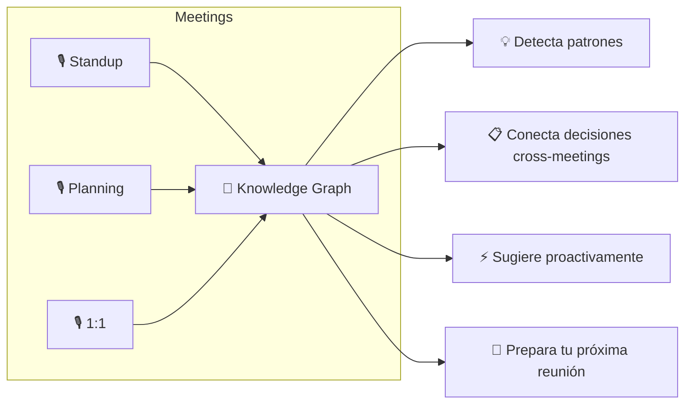
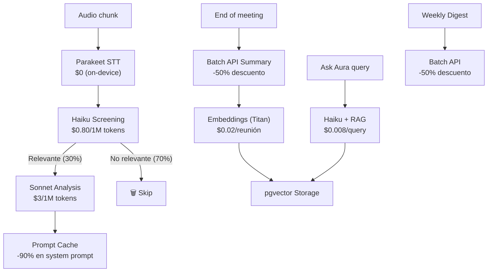

# 🧠 Aura Meet — Vision 2026: The Learning AI Copilot

> **No somos una app que graba reuniones. Somos un segundo cerebro que aprende de cada conversación.**

---

## 🔮 La Visión

Cada reunión alimenta tu **Personal Knowledge Graph**. Aura no solo transcribe — **entiende**, **conecta** y **aprende**. Cuantas más reuniones tienes, más inteligente se vuelve.



---

## 💎 Learning Copilot Features

### 1. "Ask Aura" — Chat con tus reuniones
```
Tú: "¿Qué decidimos sobre el pricing?"
Aura: "En tu reunión del 12 Feb con Carlos y Ana:
       1. Plan Pro a $9.99
       2. Free tier: 3 reuniones/semana
       📌 Pendiente: Carlos - investigar RevenueCat"
```

### 2. Pre-Meeting Briefing
Antes de cada reunión, Aura te prepara automáticamente:
- Action items pendientes de reuniones anteriores con ese equipo
- Temas recurrentes que podrían surgir
- Contexto relevante de reuniones pasadas

### 3. Weekly Digest AI
Resumen semanal: horas en meetings, action items completados vs pendientes, tema dominante, sugerencias de productividad.

### 4. Adaptive Personality
El copilot aprende TU estilo: idioma preferido, nivel de detalle, formato, y tono. Se adapta con cada reunión.

### 5. Cross-Meeting Intelligence
Conecta ideas entre reuniones diferentes: "La propuesta de cache de Carlos es similar a lo que sugirió Ana hace 2 semanas."

### 6. Follow-up Automático
"Hace 5 días dijiste que ibas a revisar el PR de Juan. ¿Ya lo hiciste?"

---

## ⚡ Arquitectura 2026 — Maximum Power, Minimum Cost

### 🧬 Stack Tecnológico State-of-the-Art

| Componente | Tecnología | Por qué es lo mejor 2026 |
|---|---|---|
| **Compute** | AWS Graviton4 (c8g) ARM | **37% más barato** que x86, 30% más rápido |
| **Container** | ECS Fargate ARM64 + Spot | **74% descuento** en Spot ARM vs On-Demand x86 |
| **STT** | Parakeet TDT v3 (on-device) | $0 por token, 250x real-time |
| **AI Screening** | Haiku 3.5 via Bedrock | $0.80/1M tokens — filtro barato |
| **AI Analysis** | Sonnet 4.5 via Bedrock | Solo para insights relevantes (post-filter) |
| **AI Summaries** | Bedrock **Batch API** | **50% descuento** para procesamiento async |
| **Model Routing** | Bedrock **Intelligent Prompt Routing** | **30% ahorro** automático por complejidad |
| **Prompt Caching** | Bedrock Prompt Caching | **90% ahorro** en system prompts repetidos |
| **Vector DB** | PostgreSQL + **pgvector + pgvectorscale** | **28x mejor latencia** que Pinecone, 25% del costo |
| **Knowledge Graph** | PostgreSQL JSON + relaciones | Sin DB adicional, unified stack |
| **Audio Storage** | S3 Intelligent-Tiering | Auto-migra a Glacier después de 30 días |
| **Cache** | ElastiCache Valkey (Serverless) | Redis-compatible, pay-per-request |

### 🎯 Optimizaciones de Costo AI



| Optimización | Ahorro |
|---|---|
| Intelligent Prompt Routing | -30% en routing automático |
| Prompt Caching (system prompts) | -90% en inputs repetidos |
| Batch API (summaries, digests) | -50% en procesamiento async |
| Haiku screening filter (70% skip) | -70% en llamadas a Sonnet |
| **Ahorro total combinado** | **~55% vs enfoque naive** |

---

## 📊 Costos Reales — Optimizados al Máximo

### Infraestructura por Fase

| Fase | Componente | Specs | Costo/mes |
|---|---|---|---|
| **1: Launch** | EC2 c8g.xlarge (Graviton4) | 4 vCPU ARM, 8GB | **$79** |
| | EBS gp3 30GB | Storage | $2.40 |
| | Elastic IP | Static | $3.65 |
| | **Total Fase 1** | | **$85/mes** |
| | | | |
| **2: Growth** | ECS Fargate ARM64 (2-8 tasks) | 4vCPU/8GB each | $150-400 |
| | RDS PostgreSQL db.t4g.micro | pgvector, Graviton | $12 |
| | S3 Intelligent-Tiering | Audio + exports | $3 |
| | ALB | Load balancer | $22 |
| | **Total Fase 2** | | **$187-437/mes** |
| | | | |
| **3: Scale** | ECS Fargate ARM64 Spot (multi-AZ) | Auto-scale cluster | $300-1,200 |
| | RDS db.t4g.medium (multi-AZ) | pgvector + pgvectorscale | $48 |
| | ElastiCache Valkey Serverless | Sessions | ~$10 |
| | S3 + Glacier | Archive | $5 |
| | SQS | Async jobs | $1 |
| | CloudFront | CDN | $5 |
| | **Total Fase 3** | | **$369-1,269/mes** |

### Comparación: Arquitectura Naive vs Optimizada

| Item | Naive (x86, on-demand) | Optimizado (Graviton4 + Spot) |
|---|---|---|
| EC2/Fargate compute | $124/mes | **$79/mes** (-37%) |
| Bedrock AI (por usuario) | $1.78/mes | **$0.80/mes** (-55%) |
| Vector DB (Pinecone) | $70/mes | **$0** (pgvector incluido) |
| Redis (ElastiCache cluster) | $50/mes | **$10** (Valkey Serverless) |

### Costo AI por Usuario/mes (Optimizado)

| Componente | Sin optimizar | Con optimización | Ahorro |
|---|---|---|---|
| Screening (Haiku) | $0.12 | $0.08 (prompt cache) | -33% |
| Analysis (Sonnet) | $0.48 | $0.14 (70% filtrado + cache) | -71% |
| Summary | $0.90 | $0.45 (Batch API) | -50% |
| Embeddings | $0.02 | $0.02 | — |
| Ask Aura (RAG) | $0.08 | $0.05 (Haiku + cache) | -38% |
| Weekly Digest | $0.18 | $0.06 (Batch + cache) | -67% |
| **Total/user/mes** | **$1.78** | **$0.80** | **-55%** |

---

## 💰 Pricing & Unit Economics

### Pricing

| Plan | Precio | Incluye |
|---|---|---|
| **Free** | $0 | 3 reuniones/semana, transcripción, 1 insight/reunión |
| **Pro** | **$9.99/mes** | Ilimitado, Ask Aura, Weekly Digest, Briefings, export, history |
| **Team** | **$19.99/user/mes** | Pro + shared knowledge base, team analytics, integrations |
| **Business** | **$39.99/user/mes** | Team + SSO, API, custom models, SLA |

### Revenue vs Costs (25% Pro conversion)

| Total users | Paying | Infra | AI cost | Revenue | **Profit** |
|---|---|---|---|---|---|
| 200 | 50 | $85 | $40 | $500 | **+$375** |
| 500 | 125 | $187 | $100 | $1,249 | **+$962** |
| 1,000 | 250 | $250 | $200 | $2,498 | **+$2,048** |
| 5,000 | 1,250 | $600 | $1,000 | $12,488 | **+$10,888** |
| 10,000 | 2,500 | $1,000 | $2,000 | $24,975 | **+$21,975** |

> [!IMPORTANT]
> **Profitable desde el día 1 con 200 usuarios** gracias a las optimizaciones. Margen de ~75% a escala.

---

## 🏗️ Evolución de Arquitectura

### Fase 1: Launch (0-500 users) — **$85/mes**

```
iPhone ──WebSocket──▶ EC2 c8g.xlarge (Graviton4 ARM)
                       ├── FastAPI (uvicorn)
                       ├── Parakeet TDT v3 (STT)
                       ├── PostgreSQL embedded (pgvector)
                       └──▶ Bedrock API (Haiku/Sonnet)
                             └── Prompt Cache enabled
                             └── Intelligent Routing
```

### Fase 2: Growth (500-5K users) — **$187-437/mes**

```
iPhone ──▶ ALB ──▶ ECS Fargate ARM64
                    ├── STT Tasks (CPU-opt) [2-8 auto-scale]
                    ├── API Tasks [2-4]
                    └──▶ Bedrock (routing + cache + batch)
           
           RDS PostgreSQL t4g.micro
           ├── pgvector + pgvectorscale
           ├── Knowledge Graph (relations)
           └── Meeting history

           S3 Intelligent-Tiering (audio archive)
```

### Fase 3: Scale (5K-50K users) — **$369-1,269/mes**

```
iPhone ──▶ CloudFront ──▶ ALB ──▶ ECS Fargate ARM64 Spot (multi-AZ)
                                   ├── STT cluster (Spot, auto-scale)
                                   ├── API cluster (On-Demand, stable)
                                   ├── Embedding workers (Spot, async)
                                   └──▶ Bedrock cross-region

           RDS PostgreSQL t4g.medium (multi-AZ, pgvectorscale)
           ElastiCache Valkey Serverless (sessions)
           SQS (async: summaries, digests, embeddings)
           S3 + Glacier (audio lifecycle)
           CloudWatch + X-Ray (observability)
```

### Fase 4: Global (50K+ users) — Futuro

```
Multi-region (US + LATAM)
Aurora Serverless v2 + pgvector
ECS everywhere (multi-region)
Bedrock cross-region inference
CloudFront Global Accelerator
```

---

## 🗺️ Roadmap por Sprints

### Sprint 1: Monetización (3 sem)
- [ ] RevenueCat — subscriptions iOS/Android
- [ ] Paywall UI con Free/Pro/Team
- [ ] Meeting History (PostgreSQL)
- [ ] Export (copy, share, email)
- [ ] Privacy Policy + Terms

### Sprint 2: Memory Engine (3 sem)
- [ ] PostgreSQL + pgvector + pgvectorscale
- [ ] Embeddings pipeline (Titan)
- [ ] "Ask Aura" — RAG chat
- [ ] Speaker Diarization (pyannote)

### Sprint 3: Intelligence (4 sem)
- [ ] Knowledge Graph (entities + relations)
- [ ] Pre-Meeting Briefing automático
- [ ] Weekly Digest AI (Batch API)
- [ ] Action item tracking + follow-up
- [ ] Vocabulario personal / adaptive personality

### Sprint 4: Cost Optimization (2 sem)
- [ ] Migrar EC2 → c8g.xlarge (Graviton4)
- [ ] Bedrock Prompt Caching
- [ ] Bedrock Intelligent Prompt Routing
- [ ] Batch API para summaries/digests
- [ ] S3 Intelligent-Tiering + lifecycle

### Sprint 5: Growth (3 sem)
- [ ] Android app (Flutter = mismo code)
- [ ] Apple Watch companion
- [ ] ECS Fargate ARM64 migration
- [ ] Onboarding premium

### Sprint 6: Diferenciación (4 sem)
- [ ] Live Coaching en reuniones
- [ ] Chrome Extension (virtual meetings)
- [ ] Slack/Notion integration
- [ ] CRM sync (Team/Business plan)

---

## 🛡️ Competitive Moat

| Moat | Detalle | Copiable? |
|---|---|---|
| **Data lock-in** | Más reuniones = copilot más inteligente | 🔒 Imposible |
| **STT propio** | Parakeet on-device, sin API cloud | 🔒 Difícil |
| **AI screening real-time** | Único en el mercado | 🔒 Medio |
| **Background + push** | Único en mobile | 🔒 Medio |
| **Costo optimizado** | 55% más barato que enfoque naive | 🔒 Difícil |
| **LATAM-first** | Nativo ES/PT, no add-on | 🔒 Medio |

> [!CAUTION]
> **El moat real es la DATA.** Cuantas más reuniones tenga un usuario, más inteligente se vuelve Aura, y más difícil es cambiarse. Esto crea un **lock-in positivo** donde el usuario QUIERE quedarse.

---

## 🎯 Conclusión

Con esta arquitectura:
- **Profitable desde 200 usuarios** (no 2,000)
- **75% margen** a escala
- **55% más barato** que la competencia en infra
- **Tecnología 2026** más avanzada (Graviton4, pgvectorscale, Bedrock optimizations)
- **Learning copilot** que nadie más tiene
