# 🧠 Aura Meet — Vision 2026: The Learning AI Copilot

> **No somos una app que graba reuniones. Somos un segundo cerebro que aprende de cada conversación.**

---

## 🔮 La Visión

Cada reunión alimenta tu **Personal Knowledge Graph**. Aura no solo transcribe — **entiende**, **conecta** y **aprende**. Cuantas más reuniones tienes, más inteligente se vuelve.

```mermaid
graph LR
    subgraph "Meetings"
        M1["🎙️ Standup"] --> KG
        M2["🎙️ Planning"] --> KG
        M3["🎙️ 1:1"] --> KG
    end
    KG["🧠 Knowledge Graph"] --> P1["💡 Detecta patrones"]
    KG --> P2["📋 Conecta decisiones cross-meetings"]
    KG --> P3["⚡ Sugiere proactivamente"]
    KG --> P4["🎯 Prepara tu próxima reunión"]
```



---

## 💎 Learning Copilot Features

### 1. "Ask Aura" — Chat con tus reuniones
```
Tú: "¿Qué decidimos sobre el pricing?"
Aura: "En tu reunión del 12 Feb con Carlos y Ana:
       1. Plan Pro a $9.99
       2. Free tier: 3 reuniones/semana
       📌 Pendiente: Carlos - investigar RevenueCat"
```

### 2. Pre-Meeting Briefing
Antes de cada reunión, Aura te prepara automáticamente:
- Action items pendientes de reuniones anteriores con ese equipo
- Temas recurrentes que podrían surgir
- Contexto relevante de reuniones pasadas

### 3. Weekly Digest AI
Resumen semanal: horas en meetings, action items completados vs pendientes, tema dominante, sugerencias de productividad.

### 4. Adaptive Personality
El copilot aprende TU estilo: idioma preferido, nivel de detalle, formato, y tono. Se adapta con cada reunión.

### 5. Cross-Meeting Intelligence
Conecta ideas entre reuniones diferentes: "La propuesta de cache de Carlos es similar a lo que sugirió Ana hace 2 semanas."

### 6. Follow-up Automático
"Hace 5 días dijiste que ibas a revisar el PR de Juan. ¿Ya lo hiciste?"

---

## ⚡ Arquitectura 2026 — Zero Cost, Maximum Power

> [!IMPORTANT]
> **Estrategia Actualizada Feb 2026.** Migramos de AWS Bedrock/Nova a **Groq Free Tier** para lograr costos de AI cercanos a $0.

### 🧬 Stack Tecnológico State-of-the-Art (Verificado Feb 2026)

| Componente | Anterior (Bedrock) | **NUEVO 2026 (Zero Cost)** | Ahorro |
|---|---|---|---|
| **AI Provider** | AWS Bedrock | **Groq (OpenAI-compatible)** | **🔥 -100% (Free Tier)** |
| **Screening** | Haiku 3.5 ($0.80/1M) | **Llama 3.3 70B** ($0) | **$0** |
| **Analysis** | Sonnet 4.5 ($3.00/1M) | **Llama 3.3 70B** ($0) | **$0** |
| **Copilot** | Sonnet 4.5 ($3.00/1M) | **Llama 3.3 70B** ($0, ~750 tok/s) | **$0** |
| **Deep Reasoning** | Opus 4 ($15/1M) | **DeepSeek R1 Distill** ($0) | **$0** |
| **Compute** | Graviton4 ($79/mo) | **EC2 t3.small** ($15/mo) | **-81%** |
| **STT** | Parakeet TDT 1.1B | **Parakeet TDT 0.6B / Moonshine** | **$0** (On-device) |
| **DB** | RDS | **PostgreSQL embedded** (EC2) | **$0** |

### 🔥 Descubrimiento Clave: Groq LPU Inference

Groq ofrece **6,000 requests/día GRATIS** con modelos de primer nivel (Llama 3.3, DeepSeek R1).
Esto nos permite procesar ~300 reuniones diarias sin pagar un centavo en inferencia.

### 🧠 Modelo de Routing Multi-LLM Optimizado

```mermaid
graph TD
    A["Audio chunk"] --> B["Parakeet TDT 0.6B / Moonshine<br/>$0 on-device"]
    B --> C["Llama 3.3 Screening<br/>$0 (Groq Free)"]
    C -->|"Relevante (30%)"| D["Llama 3.3 Analysis<br/>$0 (Groq Free)"]
    C -->|"No relevante (70%)"| E["🗑️ Skip"]
    
    G["Copilot Query"] --> H["Llama 3.3 70B<br/>$0 — 750 tok/s para UX instantánea"]
    H --> J["pgvector RAG"]
    
    I["End of meeting"] --> K["Llama 3.3 Summary<br/>$0 (Groq Free)"]
    K --> L["Titan Embeddings v2<br/>$0.02/1M"]
    L --> J
    
    M["Deep Analysis"] --> N["DeepSeek R1<br/>$0 — Reasoning superior"]
    
    O["Weekly Digest"] --> P["Llama 3.3 Batch<br/>$0"]
```



---

## 📊 Costos Reales — Ultra-Optimizados

### Costo AI por Usuario/mes (Comparación)

| Componente | Bedrock Plan | **Plan Zero-Cost** | Ahorro |
|---|---|---|---|
| Screening | $0.08 | **$0.00** | **-100%** |
| Analysis | $0.14 | **$0.00** | **-100%** |
| Summary | $0.45 | **$0.00** | **-100%** |
| Copilot | $0.05 | **$0.00** | **-100%** |
| Embeddings | $0.02 | $0.02 | — |
| **Total/user/mes** | **$0.80** | **$0.02** | **🔥 -97.5%** |

### Infraestructura por Fase

| Fase | Total/mes | Detalle |
|---|---|---|
| **1: Launch** (0-1K) | **$22** | EC2 t3.small, PostgreSQL embedded, Groq Free |
| **2: Growth** (1K-5K) | **$60-100** | EC2 c6i.large o Hetzner, Groq Pay-as-you-go |
| **3: Scale** (5K+) | **$200+** | Infra escalada, vLLM propio si Groq sube precio |

---

## 🏗️ Evolución de Arquitectura

### Fase 1: Zero-Cost Launch (0-1K users) — **$22/mes**

```
iPhone ──WebSocket──▶ EC2 t3.small (x86, $15/mo)
                       ├── FastAPI (uvicorn)
                       ├── Parakeet/Moonshine (STT on-device)
                       ├── PostgreSQL embedded + pgvector
                       └──▶ Groq API (OpenAI-compatible)
                             ├── Llama 3.3 70B (screening, analysis, copilot)
                             ├── DeepSeek R1 (deep reasoning)
                             └── Free Tier (6K req/day)
```

### Fase 2: Growth (1K-5K users) — **$60-100/mes**

```
iPhone ──▶ CloudFront ──▶ EC2 c6i.large / Hetzner AX102
                           ├── STT Tasks (Docker swarm / k3s)
                           ├── PostgreSQL NVMe
                           └──▶ Groq Paid / Together AI
```

---

## 🗺️ Roadmap por Sprints (Auditado)

### Sprint 1: Zero-Cost Migration (Esta semana)
- [ ] **Configurar Groq:** `OPENAI_BASE_URL` en `.env`.
- [ ] **Configurar DeepSeek R1:** Para análisis profundo.
- [ ] **Validar t3.small:** Performance test con Parakeet 0.6B.

### Sprint 2: Monetización Automática
- [ ] RevenueCat Dashboard setup.
- [ ] Paywall UI flow final.
- [ ] 7-day free trial config.

### Sprint 3: Marketing Automático
- [ ] Carrd landing page.
- [ ] Buffer social posts.
- [ ] Brevo emails.

---

## 🎯 Conclusión — Por qué esta es la arquitectura definitiva 2026

| Métrica | Arquitectura Bedrock | **Aura Zero-Cost 2026** |
|---|---|---|
| Costo AI/user/mes | $1.78 | **$0.02 (-97%)** |
| Compute | $124/mo | **$15/mo (t3.small)** |
| Profitable desde | 500 users | **2 usuarios pagando** |
| Margen a escala | 60% | **99%** |

> Con esta arquitectura, **cada $1 de revenue genera $0.99 de profit.** Es una máquina de imprimir dinero con cero costo operativo variable.

---

*Documento actualizado: Febrero 16, 2026*
*Arquitectura validada con Groq Free Tier y EC2 t3.small.*
